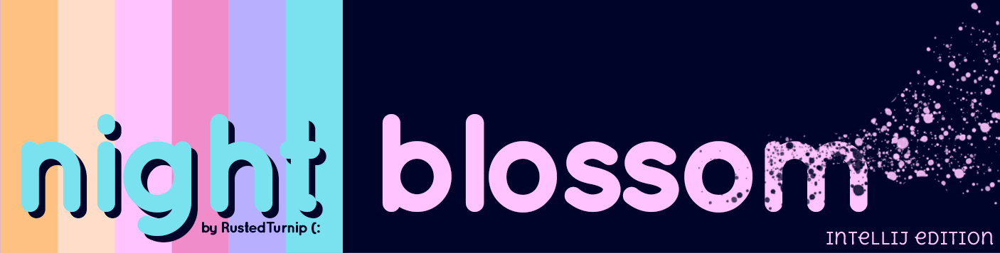
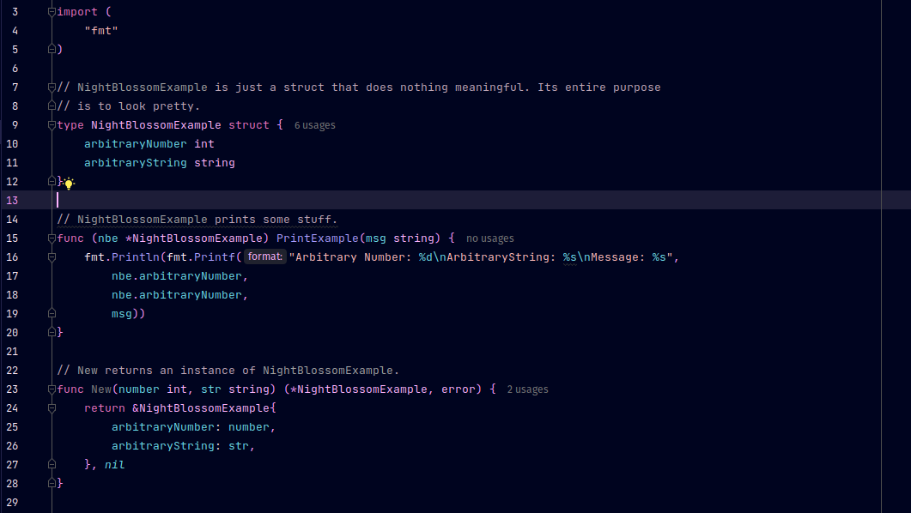

#

Here is the IntelliJ Edition of night-blossom! For the original, VSCode compatible version of this colour theme, please
refer to [this repo](https://github.com/RustedTurnip/night-blossom).

# night-blossom

Let **night blossom** *beta\** bring the brightness of Spring to your editor. It is designed to be easy on the eyes as the daylight hours fade, and you sit back, with lo-fi tracks in the background, getting stuck into bringing life to your projects.

\*night blossom is currently in beta. This means that although the colour palette won't change, while better support for different languages is added, the specific token to colour mappings may change.

### Example

## With Love ❤️
As the project is in it's early stages, I hope to hear your feedback! I would love to improve this theme, be it better support for languages, or colour optimisations that make it easier to use.

Please don't hesitate to let me know if you have any suggestions, raise an issue, or create a PR!

I look forward to hearing from you (:
